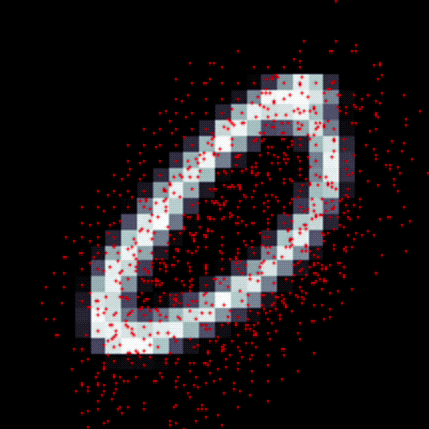

# PyTorch implementation of Deformable Convolution

 **!!!Warning: There is some issues in this implementation and this repo is not maintained any more, please consider using for example: [TORCHVISION.OPS.DEFORM_CONV](https://pytorch.org/vision/stable/_modules/torchvision/ops/deform_conv.html)**
 

 * By Wei OUYANG @ Institut Pasteur
 * Thanks to Felix Lau's Keras/TensorFlow implementation: ~~https://github.com/felixlaumon/deform-conv~~ (https://github.com/kastnerkyle/deform-conv)

### TODO List
 - [x] implement offsets mapping in pytorch
 - [x] all tests passed
 - [x] deformable convolution module
 - [x] Fine-tuning the deformable convolution modules
 - [x] scaled mnist demo
 - [x] improve speed with cached grid array
 - [ ] use MNIST dataset from pytorch (instead of Keras)
 - [ ] support input image with different width and height
 - [ ] benchmark with tensorflow implementation

## Deformable Convolutional Networks
> Dai, Jifeng, Haozhi Qi, Yuwen Xiong, Yi Li, Guodong Zhang, Han Hu, and Yichen
Wei. 2017. “Deformable Convolutional Networks.” arXiv [cs.CV]. arXiv.
http://arxiv.org/abs/1703.06211

The following animation is generated by Felix Lau (with his tensorflow implementation):

Also Check out Felix Lau's summary of the paper: https://medium.com/@phelixlau/notes-on-deformable-convolutional-networks-baaabbc11cf3
